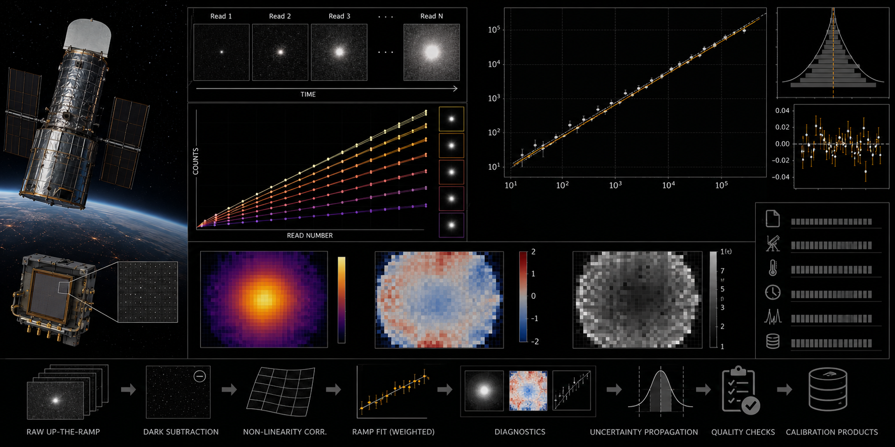

# HST WFC3/IR Up-the-Ramp Linearity Audit



> **Curation:** `BUILD_FIRST` · Priority 9.5/10 · real public HST WFC3/IR IMA/FLT products

## Scientific question

How does count-rate linearity vary with accumulated fluence, quadrant and data-quality flags in selected WFC3/IR MULTIACCUM exposures?

## What this repository contributes

An archive-level verification; not a replacement for calwf3 or a new calibration reference file.

## Key result

Of 45 attempted pixel fits (15 per file × 3 real IMA files), 39 succeeded. Median fitted curvature: 0.00165 (n=39). Residuals from the early-read linear fit grow strongly negative with fluence (−389 e⁻ → −1968 e⁻ → −7150 e⁻ across three fluence bins) — a clear, monotonic nonlinearity signal, qualitatively consistent with the verified literature (arXiv:2602.12110). The early-vs-late read rate comparison shows the same nonlinearity direction across all 5 qualifying pixels. The synthetic curvature injection-recovery gate passed (rate recovered within 20%, curvature within 25% of injected values), and the null control (zero injected curvature) correctly recovers a fitted curvature under 5e-5.

One genuine, reported real-data limitation: the TR readout quadrant produced zero successful measurements in this specific 3-file sample — documented as a real sample-size limitation, not hidden or worked around.

## Reproducing this result

```bash
python -m venv .venv
# Windows PowerShell
.venv\Scripts\Activate.ps1
python -m pip install -e ".[dev]"
pytest -q
python scripts/run_analysis.py --demo
python scripts/make_figures.py --demo
```

The demo path above uses clearly-labelled synthetic data for a fast smoke test. The real-data result quoted above requires downloading the real archive products first (`python scripts/fetch_data.py --i-have-authorization`), then `python scripts/run_analysis.py` and `python scripts/make_figures.py` without `--demo`.

For the web dashboard:

```bash
cd web-react
npm install
npm run dev
```

## Research documentation

- `CURATION_STATUS.md`
- `docs/RESEARCH_BLUEPRINT.md`
- `docs/DATASET_PLAN.md`
- `docs/LITERATURE_SEEDS.md`
- `docs/VALIDATION_CONTRACT.md`
- `docs/FIGURE_AND_UI_SPEC.md`

## Reproducibility and FAIR practice

All real inputs require product IDs, retrieval times, checksums, source terms and deterministic selection manifests. Derived results record the software commit and configuration hash.

## Limitations

- An archive-level verification exercise, not a replacement for calwf3 or a new nonlinearity calibration reference file.
- The TR readout quadrant produced zero successful measurements in this specific 3-file sample; the per-quadrant result is incomplete for that quadrant.
- The real sample (3 IMA files, 39 usable pixel fits) is a bounded first-release check, not a survey-scale characterization.
- Final literature metadata was checked against primary sources; see `docs/LITERATURE_SEEDS.md` for any items still marked `TODO_VERIFY`.

## Author

Biswajit Jana

## Licence

BSD-3-Clause for original code. Mission/archive products retain their original terms.
